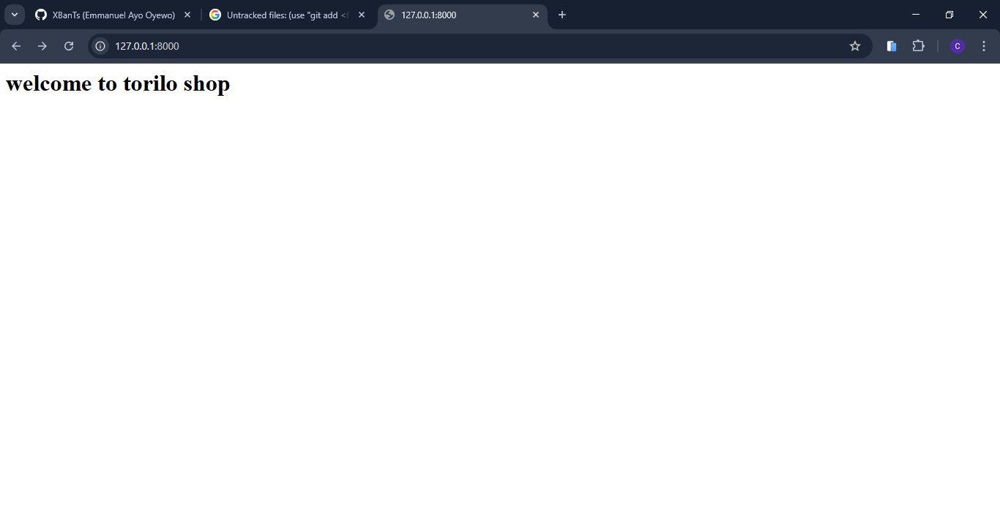
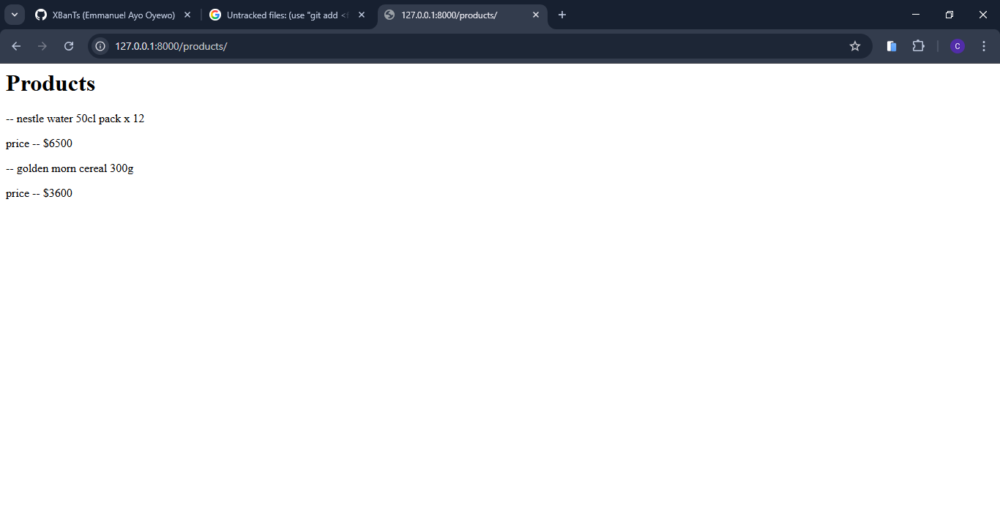
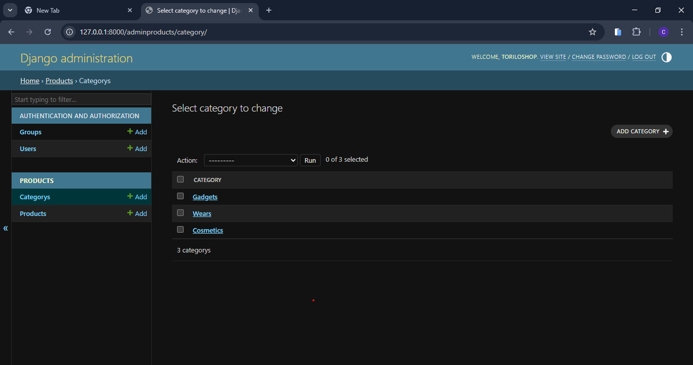
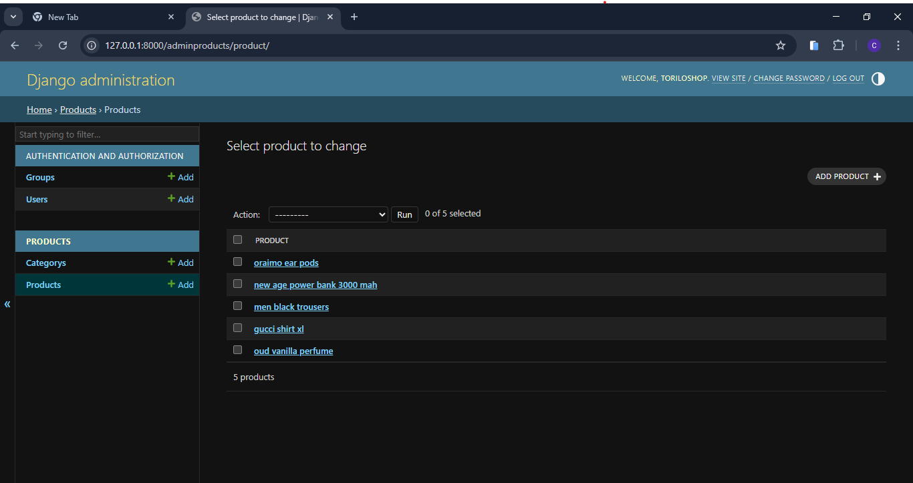
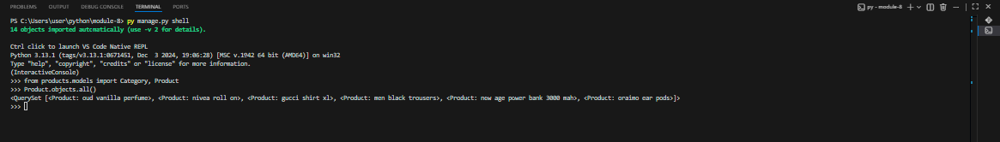
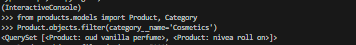
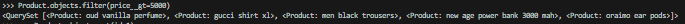
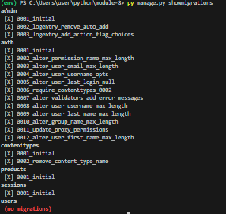

<<<<<<< HEAD
## name : MICHAEL ADEYANJU 
=======
### PROJECT DESCRIPTION 
    WHAT IS TORILO SHOP: torilo shop is a backend E - commerce app .

    WHAT DOES TORILO SHOP DO : its an app that displayes products for 
users and allows users to buy products. the backend allows the user to be able to buy and 
sell products.

### Models 
        1. Category model : this is like the descripton and type of the prodcts (for each product there`s a category) this saves the category of each product to the database.
        2. Product model: this saves the product to the database (with the category (using foriegn key)).
### MODEL FEATURE
| MODEL                         | FIELDS                                                              | ORM OPERATIONS
|-------------------------------|---------------------------------------------------------------------|-----------------------------------------------------------------------------------------------------------|
| 1. Category Model             | a. id : Primary key auto incremented                                | a. py manage.py shell   - intialize shell or start shell            
|                               | b. name field : CharField for name                                  | b. from products.models import Product, Category - this is to import the models in shell
|                               | c. description field : TextField for description                    | c. cat = Category.objects.create(name='', description='') - this is to add categories to db
|-------------------------------|---------------------------------------------------------------------|-----------------------------------------------------------------------------------------------------------|
| 2. Product Model              | a. id : Primary key auto incermented                                | a. p1 = Product.objects.create(name='', price=, stock=, category=) - to add product to the db in shell
|                               | b. name : CharField for name max lenght = 100                       | b. Products.objects.all() - this is to get all products from db
|                               | c. price : DecimalField for price                                   | c. Product.objects.filter(category__name= ) - this is to get products that belongs to particular category
|                               | d. stock : IntegerField for stock                                   | d. Product.objects.filter(price__gt= ) - this is to get products greater than 5000
|                               | e. category : ForiegnKey to link both models                        |
|                               | d. created_at : DateTimeField for record                            |
|_______________________________|_____________________________________________________________________|_____________________________________________________________________________________________________________

## TORILO SHOP FEATURES 

| FEATURES                      | FEATURE CODE                        | URL FOR THE FEATURE
|-------------------------------|-------------------------------------|---------------------------------------------------------------------|
| 1. View products              |   in the products views.py we used  | url : products/ is the path in the url 
|                               | the product_list view to            | to view the products in the browser.
|                               | display products to user.           |
|-------------------------------|-------------------------------------|----------------------------------------------------------------------|
| 2. about                      |   in the product views.py we used   | url : about/ is the path in the url to 
|                               | the about view to let users now     | view the about info of torilo shop in the 
|                               | about torilo shop.                  | browser.
|-------------------------------|-------------------------------------|----------------------------------------------------------------------|
| 3. home                       |   in the products views.py we used  | url : we use the / since its the first page users are going to
|                               | the home view to display a welcome  | view.
|                               | message to the users                |
|-------------------------------|-------------------------------------|----------------------------------------------------------------------|
| 4. 404 page                   |  in the products views.py we created| re_path(r'^.*$', page_not_found) we use the repath module 
|                               | a view to detect if a url entered is| to check for the invalid urls entered by user. its defined 
|                               | actually an existing defined url if | in the root url of the project.
|                               | not it displayes a 404 page.        |
|_______________________________|_____________________________________|______________________________________________________________________|

## SETUP INSTRUCTIONS
1. CREATE A VIRTUAL ENVRONMENT: py -m venv env would create a virtual env 
2. ACTIVATE THE VIRTUAL ENVIRONMENT: env\Scripts\Activate would activate the virtual env
3. INSTALL DJANGO:  pip install django would install django in your vitual env 
4. MAKE MIGRATIONS AND MIGRATE: py manage.py makemigrations then py manage.py migrate
5. CREATE SUPERUSER : py manage.py createsuperuser 
6. RUN SERVER : py manage.py runserver - this would start the development server note default port is 8000

# SCREEN SHOTS 
1. HOME PAGE  
2. PRODUCT PAGE 
3. ABOUT PAGE 
4. PROJECT STRUCTURE 
5. ADMIN CATEGORY LIST 
6. ADMIN PRODUCT LIST 
7. ALL PRODUCTS SHELL 
8. FILTER BY CATEGORY SHELL 
9. PRICE FILTER SHELL 
10. MIGRATION SUCCESS 
>>>>>>> 8cb4fdd71c163352cf24d922088f35d8c2e9482e
