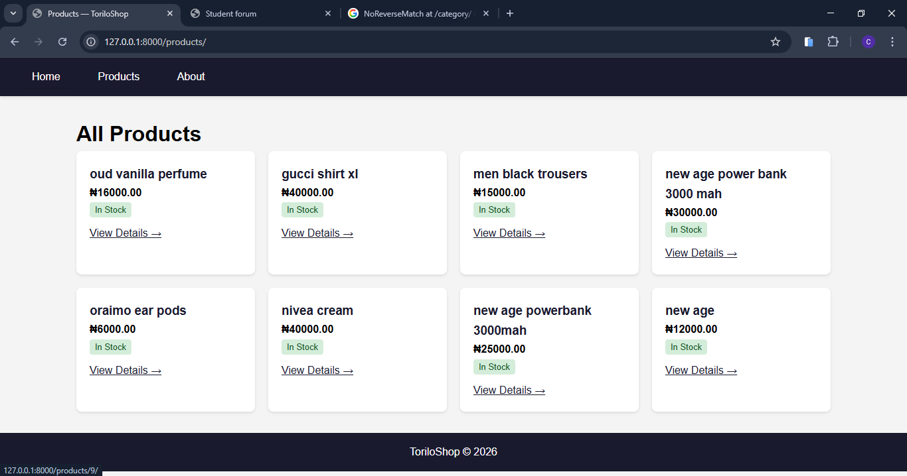
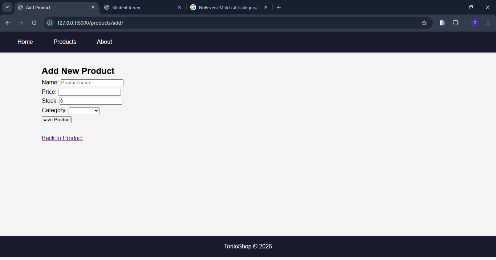
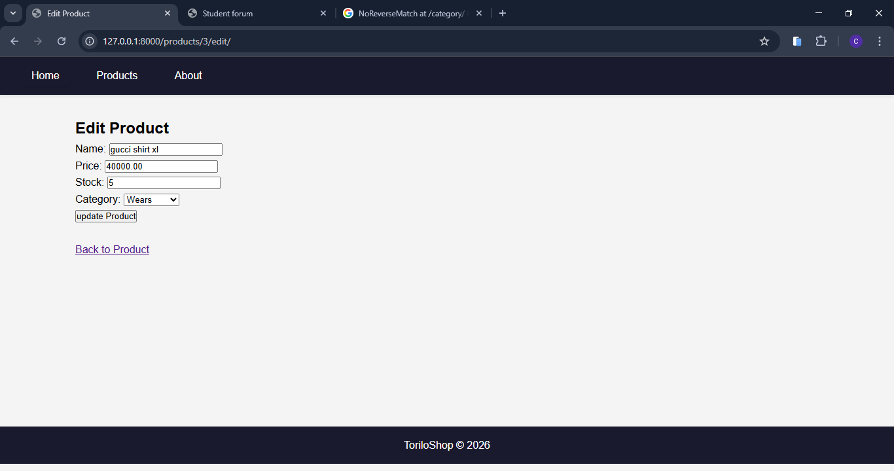
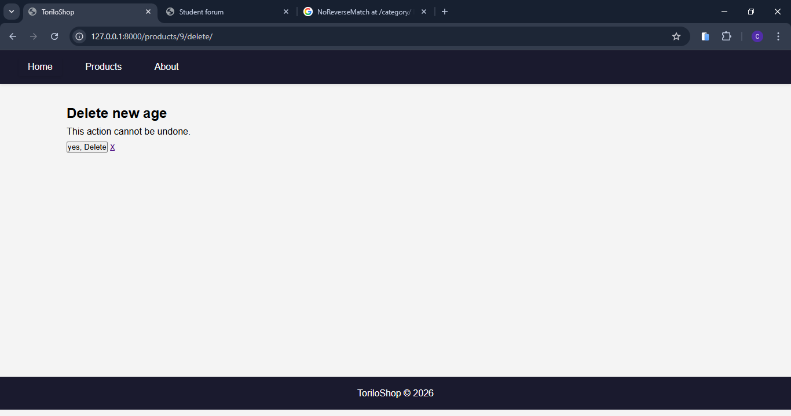
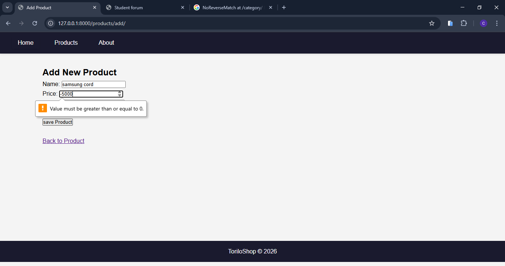
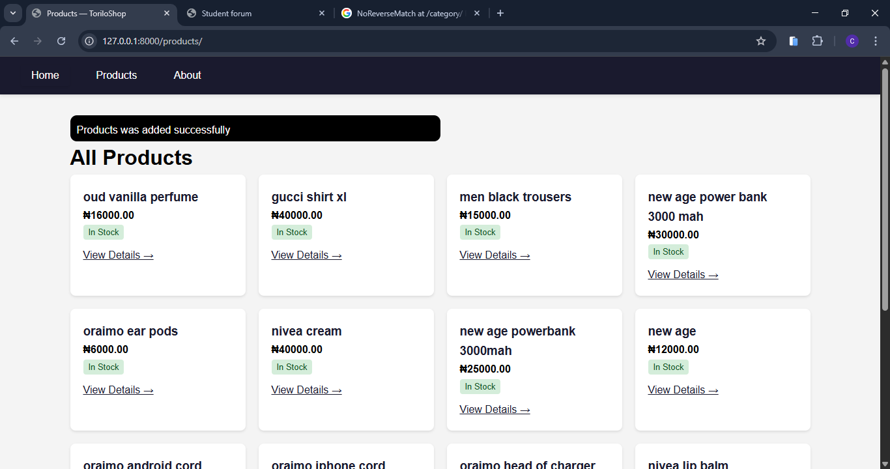

### PROJECT DESCRIPTION 
        CRUD OPERATIONS TORILOSHOP NOW SUPPORTS:
            CREATE : this uses the post method to create a new product
            READ : this use the get method to get all products
            UPDATE : used to update the product info
            DELETE : remove the product from the database
             

## TORILO SHOP FEATURES 
-------------------------------------------------------------------------------------------------------------------------------------|
|   FORM                | URL                           | WHAT IT DOES
|-----------------------|-------------------------------|------------------------------------------------
| A. ProductForm        | product/add/                  | we can add products using the fields provided by the ProductForm
|                       | product/<int:pk>/edit/        | we can edit a paarticular product using the id 
|-----------------------|-------------------------------|------------------------------------------------------------------------------
| B. CategoryForm       | categories/add/               | we can add categories using the fields provided by the CategoryForm
|                       | categories/<int:pk>/edit/     | we can edit a particular product using the id
|______________________________________________________________________________________________________________________________________|

## SETUP INSTRUCTIONS
    MOVING IN DIRECTORIES: 
        a. cd into the assignments folder
        b. cd into module-9 folder
        c. then cd into torilo shop 
1. CREATE A VIRTUAL ENVRONMENT: py -m venv env would create a virtual env 
2. ACTIVATE THE VIRTUAL ENVIRONMENT: env\Scripts\Activate would activate the virtual env
3. INSTALL DJANGO:  pip install django would install django in your vitual env 
4. MAKE MIGRATIONS AND MIGRATE: py manage.py makemigrations then py manage.py migrate
5. CREATE SUPERUSER : py manage.py createsuperuser 
6. RUN SERVER : py manage.py runserver - this would start the development server note default port is 8000

# SCREEN SHOTS 
1. PRODUCT LIST - 
2. ADD PRODUCT - 
3. EDIT PRODUCT FORM - 
4. DELETE CONFIRMATION 
5. FORM VALIDATION ERROR 
6. SUCCESS FLASH MESAGE 
