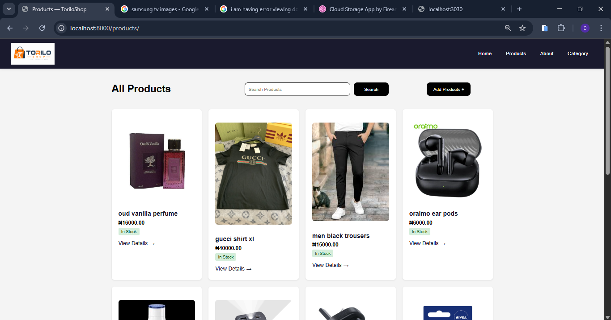
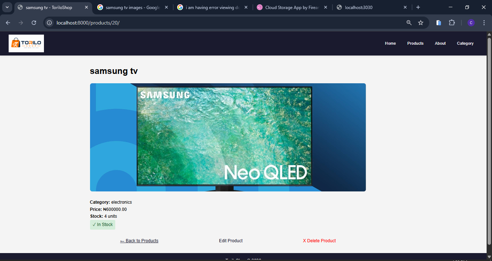
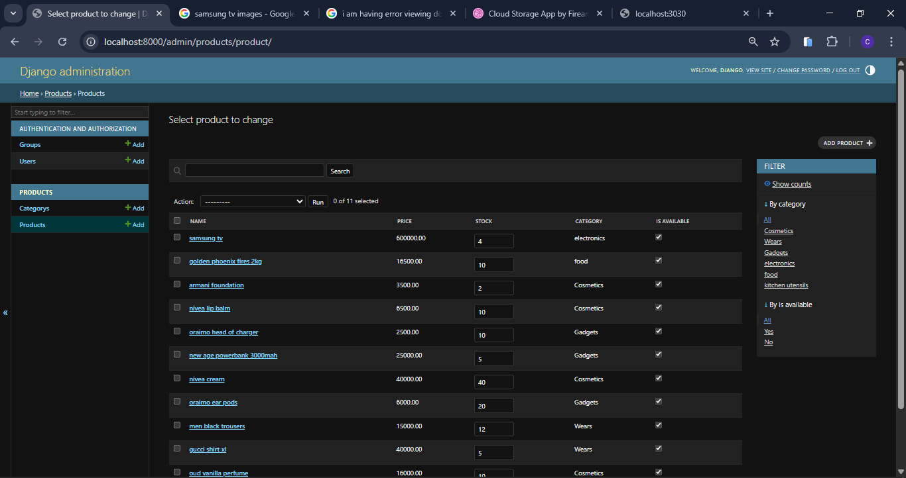
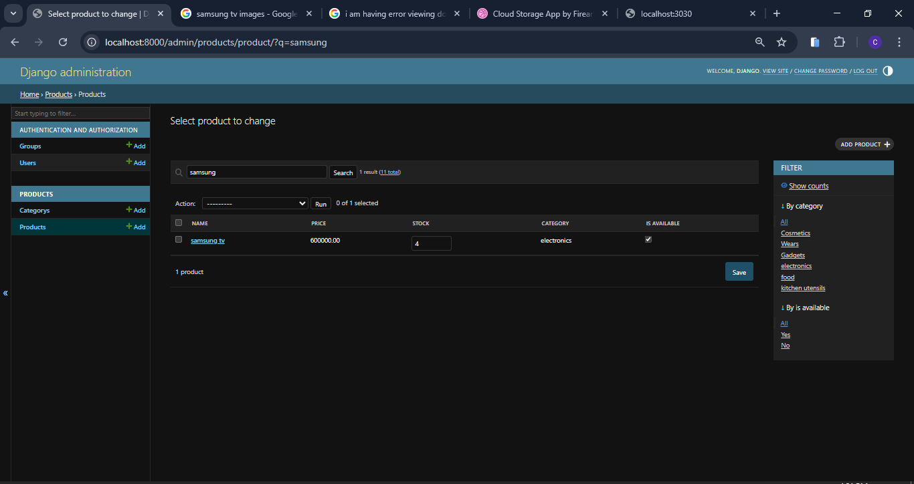
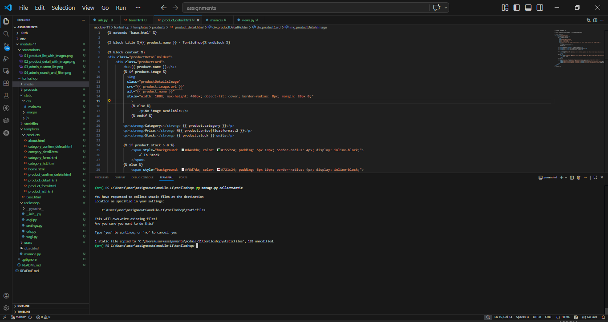

### PROJECT DESCRIPTION 
        IMPROVEMENTS : 
            a. products now has images to describe the product physically 
            b. products can now be inputed with images included 
            c. search fields to search products by name 
             

## TORILO SHOP FEATURES 
|   FEATURES                        |
|-----------------------------------|----------------------------------------------------------------------------------------------------------------------------------|
| A. CSS                            | static files new has a css file to style all pages . 
|-----------------------------------|----------------------------------------------------------------------------------------------------------------------------------|
| B. IMAGE FIELD                    | image field added to the models so users can enter products with image configred `MEDIA_ROOT/URL` for image hosting
|-----------------------------------|----------------------------------------------------------------------------------------------------------------------------------|
| C. ADMIN CUSTOMIZATION            | admin diaplays : list of products, products by category, search field 
|-----------------------------------|----------------------------------------------------------------------------------------------------------------------------------|
| D. BULK ACTION                    | BULK ACTION: added mark as out of stock to update multiple products at once
|___________________________________|__________________________________________________________________________________________________________________________________|

## SETUP INSTRUCTIONS
    MOVING IN DIRECTORIES: 
        a. cd into the assignments folder
        b. cd into module-9 folder
        c. then cd into torilo shop 
1. CREATE A VIRTUAL ENVRONMENT: py -m venv env would create a virtual env 
2. ACTIVATE THE VIRTUAL ENVIRONMENT: env\Scripts\Activate would activate the virtual env
3. INSTALL DJANGO:  pip install django would install django in your vitual env 
4. MAKE MIGRATIONS AND MIGRATE: py manage.py makemigrations then py manage.py migrate
5. CREATE SUPERUSER : py manage.py createsuperuser 
6. RUN SERVER : py manage.py runserver - this would start the development server note default port is 8000

# SCREEN SHOTS 
1. PRODUCT LIST WITH IMAGE 
2. PRODUCT DETAIL WITH IMAGES 
3. ADMIN CUSTOM LIST 
4. ADMIN SEARCH AND FILTER 
5. COLLECT STATIC OUTPUT 