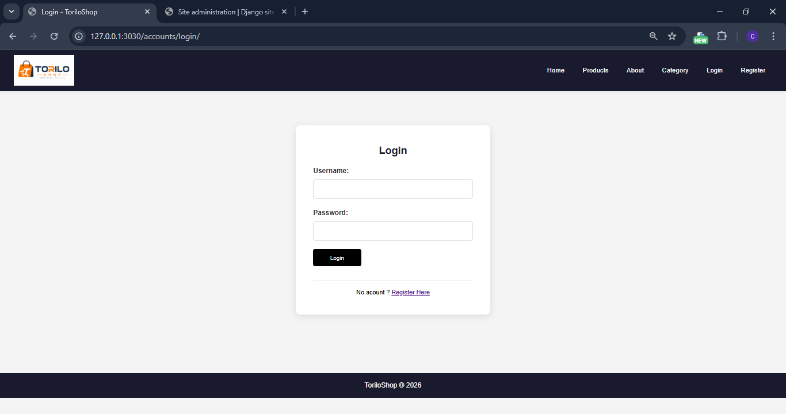
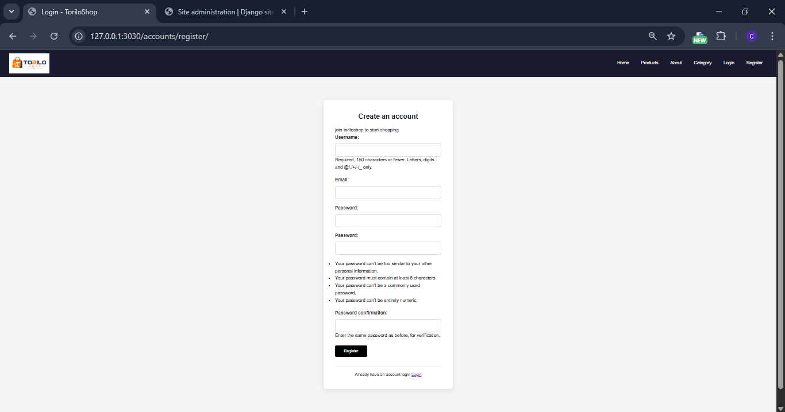
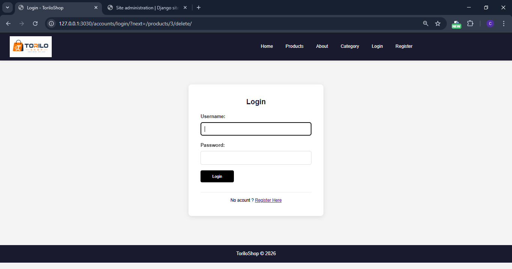
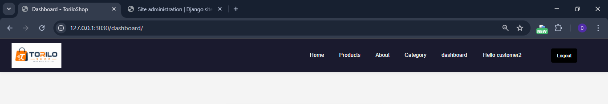
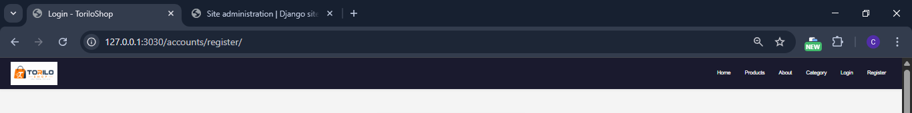

### PROJECT DESCRIPTION 
        AUTH FEATURES :
            a. login users as customers and admin
            b. register user 
            c. logout users
            d. only admin can delete products and categories 
            c. protected routes 

## TORILO SHOP FEATURES 
|   FEATURES                        |
|-----------------------------------|----------------------------------------------------------------------------------------------------------------------------------|
| A. LOGIN                          | using the built in login auth view and url to login users
|-----------------------------------|----------------------------------------------------------------------------------------------------------------------------------|
| B. LOGOUT                         | using the built in logout view and url to logout users
|-----------------------------------|----------------------------------------------------------------------------------------------------------------------------------|
| C. REGISTRATION                   | using the register form to register users.
|-----------------------------------|----------------------------------------------------------------------------------------------------------------------------------|
| D. PROTECTED ROUTES               | using @login_required to protect routes 
|-----------------------------------|----------------------------------------------------------------------------------------------------------------------------------|
| E. NAVBAR CHAGES                  | using django templates conditionals to display welcome message for logged in user or login and register links
|___________________________________|__________________________________________________________________________________________________________________________________|

## SETUP INSTRUCTIONS
    MOVING IN DIRECTORIES: 
        a. cd into the assignments folder
        b. cd into module-9 folder
        c. then cd into torilo shop 
        d. then install pillow pip install pillow or py -m pip install pillow
1. CREATE A VIRTUAL ENVRONMENT: py -m venv env would create a virtual env 
2. ACTIVATE THE VIRTUAL ENVIRONMENT: env\Scripts\Activate would activate the virtual env
3. INSTALL DJANGO:  pip install django would install django in your vitual env 
4. MAKE MIGRATIONS AND MIGRATE: py manage.py makemigrations then py manage.py migrate
5. CREATE SUPERUSER : py manage.py createsuperuser 
6. RUN SERVER : py manage.py runserver - this would start the development server note default port is 8000

# SCREEN SHOTS 
1. LOGIN PAGE 
2. REGISTER PAGE 
3. PROTECTED ROUTES REDIRECT 
4. LOGGED IN NAVBAR 
5. LOGGED OUT NAVBAR 