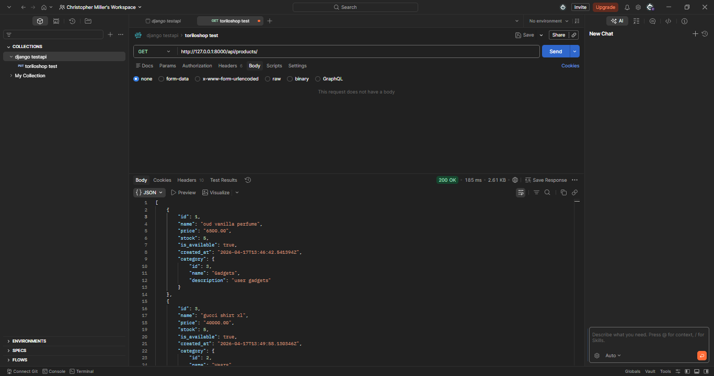
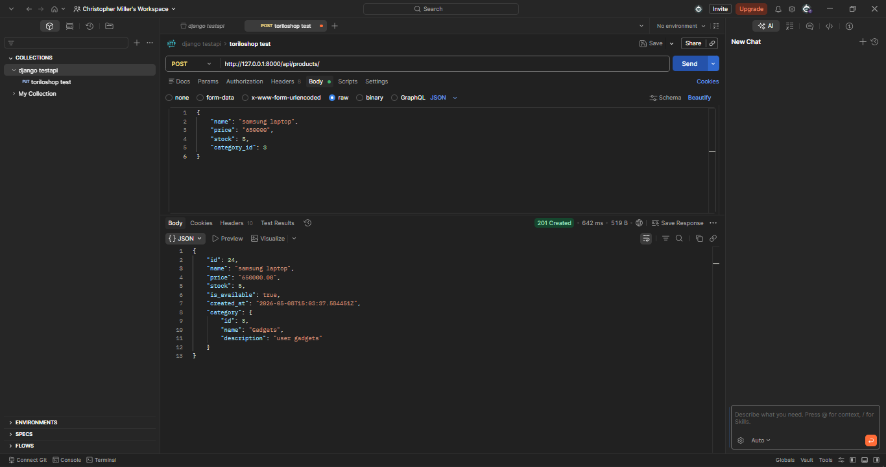
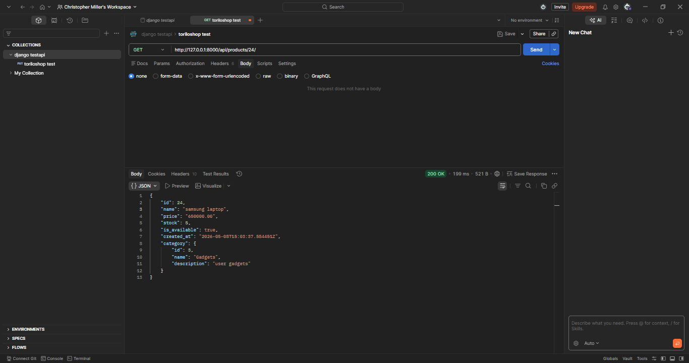
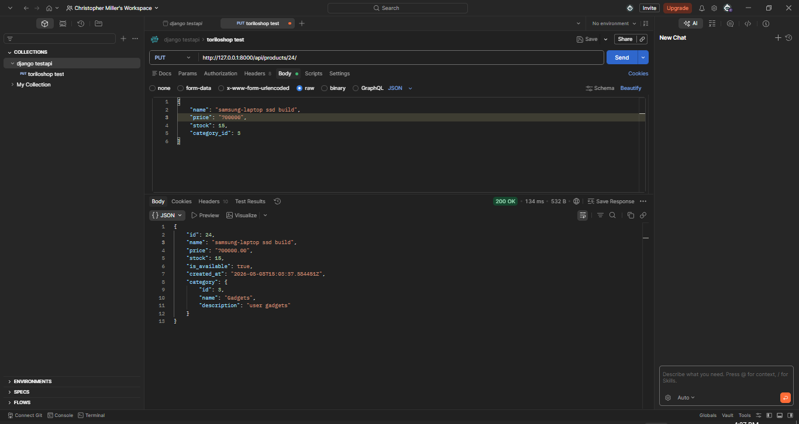
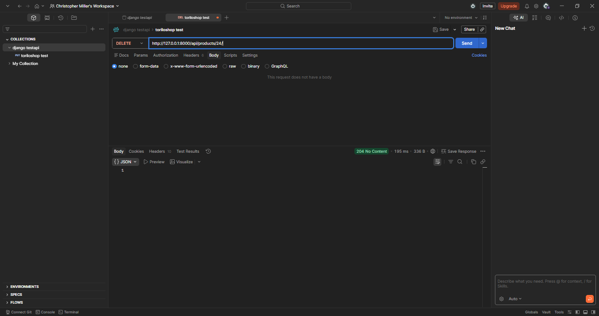
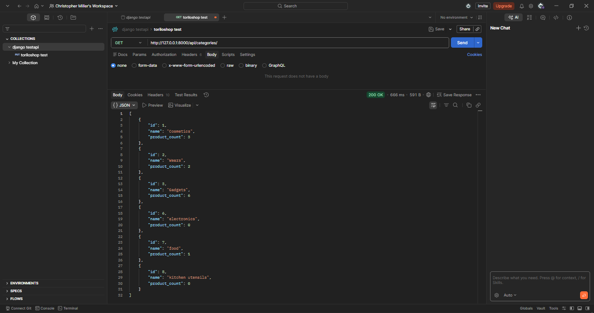

### PROJECT DESCRIPTION 
        PRODUCT API ENDPOINTS :
            | Method                | Endpoint                  | Description
            |-----------------------|---------------------------|--------------------------------------------------------|
            | **GET**               | '/api/products/'          | list all products with nested category details         
            | **POST**              | '/api/products/'          | Create a new product.
            | **GET**               | '/api/products/{id}/'     | retrive a specific product details.
            | **PUT**               | '/api/products/{id}/'     | update all fields of an exisiting product.
            | **DELETE**            | '/api/products/{id}/'     | Remove a product from the database.
        
        CATEGORY API ENDPOINTS :
            | METHOD                | ENDPOINT                  | DESCRIPTION
            |-----------------------|---------------------------|----------------------------------------------------------|
            | **GET**               | '/api/categories'         | List all categories including a dynamic 'product-count'.

## SETUP INSTRUCTIONS
    MOVING IN DIRECTORIES: 
        a. cd into the assignments folder
        b. cd into module-13 folder
        c. then cd into torilo shop 
        d. then install pillow pip install pillow or py -m pip install pillow
1. CREATE A VIRTUAL ENVRONMENT: py -m venv env would create a virtual env 
2. ACTIVATE THE VIRTUAL ENVIRONMENT: env\Scripts\Activate would activate the virtual env
3. INSTALL DJANGO:  pip install django would install django in your vitual env 
4. MAKE MIGRATIONS AND MIGRATE: py manage.py makemigrations then py manage.py migrate
5. CREATE SUPERUSER : py manage.py createsuperuser 
6. RUN SERVER : py manage.py runserver - this would start the development server note default port is 8000

# SCREEN SHOTS 
1. GET PRODUCTS  
2. POST CREATE PRODUCT 
3. GET SINGLE PRODUCT 
4. PUT UPDATE PRODUCT 
5. DELETE PRODUCT 
6. GET CATEGROIES 

## POST MAN 
a. POST MAN [DOWNLOAD POSTMAN COLLECTION](./postman_collection.json)