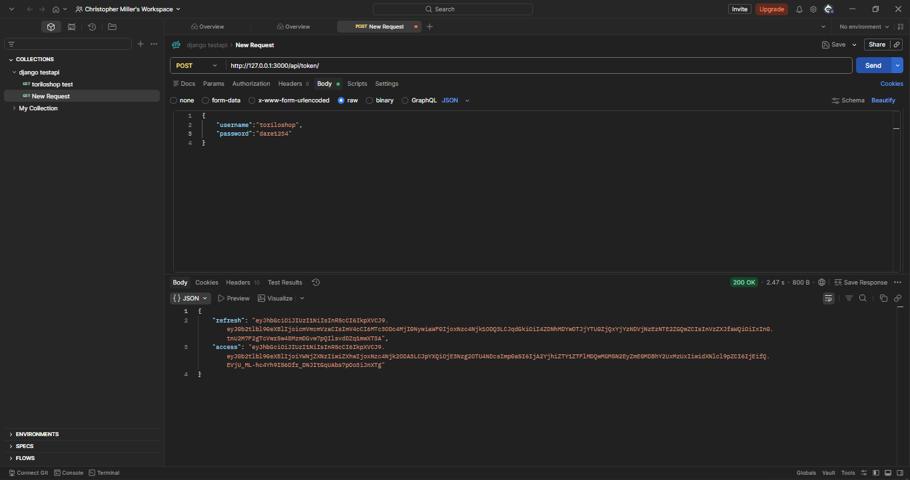
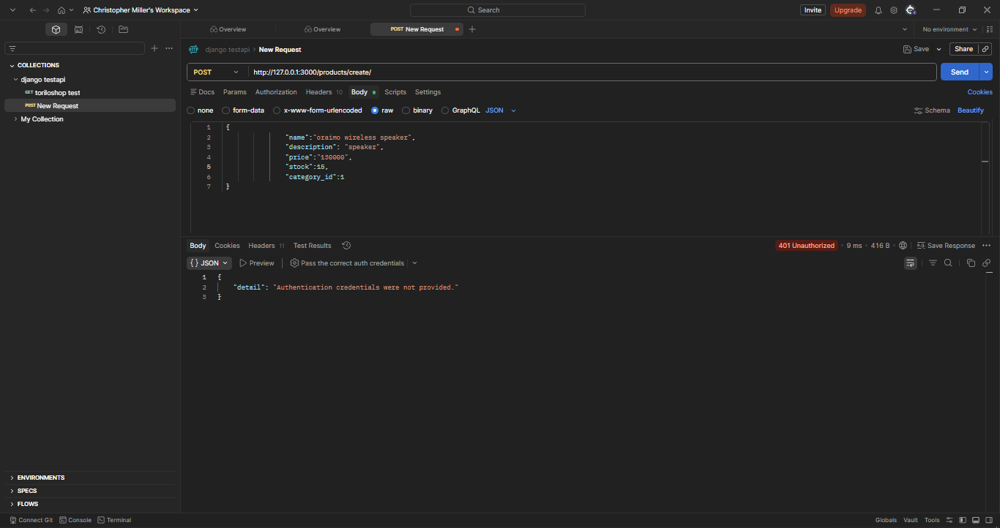
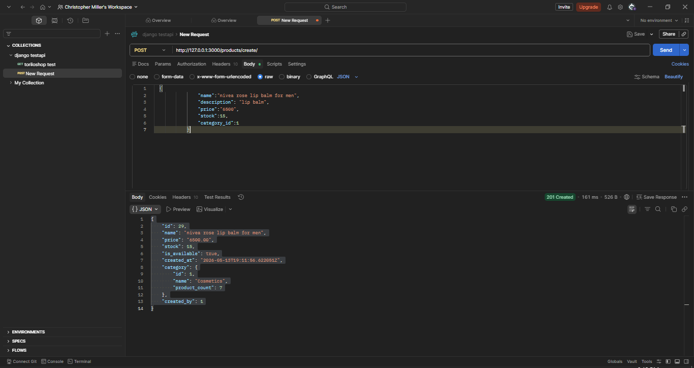
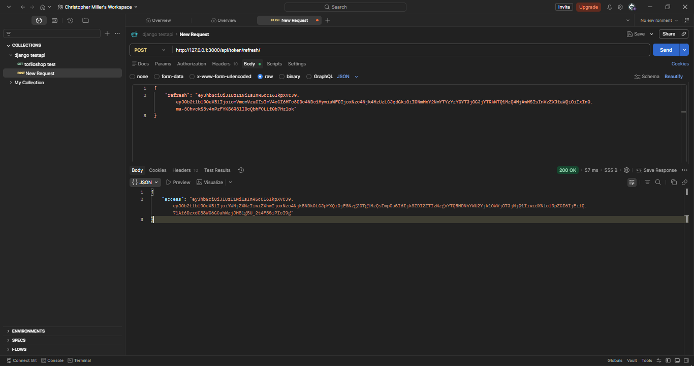
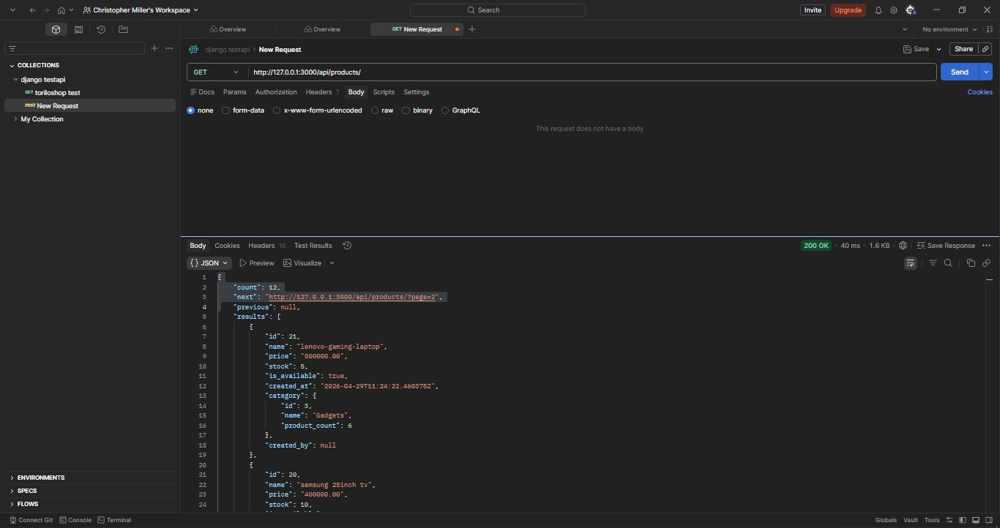
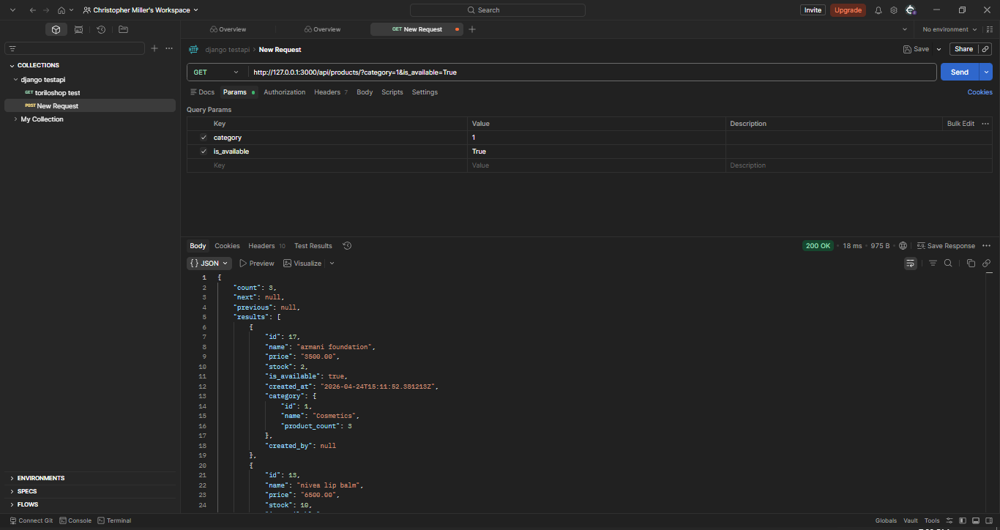

### PROJECT DESCRIPTION 

### FEATURED IMPLEMENTED
* **Dual Authentication Layer:** Built operational integrations for `TokenAuthentication` and SimpleJWT `JWTAuthentication`.
* **Resource Access Ownership Controls:** Locked modifying endpoints (`POST`, `PUT`, `DELETE`); the backend assigns a `created_by` ForeignKey tracking ID to entries automatically, restricting modification rights exclusively to the original creator.
* **Global CORS Headers Integration:** Configured open cross-origin allowances to securely permit consumption by detached modern client-side frameworks.
* **Server-Side Pagination:** Intercepted database listings to output standard 6-product batches containing programmatic navigation links (`next`/`previous`).
* **Advanced Query Interfaces:** Added exact matching for `category` and `is_available`, multi-field `search` looking across product name structures, and numerical `ordering` via item price points.
 
        
## SETUP INSTRUCTIONS
    MOVING IN DIRECTORIES: 
        a. cd into the assignments folder
        b. cd into module-13 folder
        c. then cd into torilo shop 
        d. then install pillow pip install pillow or py -m pip install pillow
        E. py -m pip install djangorestframework
        f. py -m pip install djangorestframework-simplejwt
        g. py -m pip install django-cors-headers
        h. py -m pip install django-filter
1. CREATE A VIRTUAL ENVRONMENT: py -m venv env would create a virtual env 
2. ACTIVATE THE VIRTUAL ENVIRONMENT: env\Scripts\Activate would activate the virtual env
3. INSTALL DJANGO:  pip install django would install django in your vitual env 
4. MAKE MIGRATIONS AND MIGRATE: py manage.py makemigrations then py manage.py migrate
5. CREATE SUPERUSER : py manage.py createsuperuser 
6. RUN SERVER : py manage.py runserver - this would start the development server note default port is 8000

## How to Authenticate & Test via Postman

### 1. Fetching a Session JWT Pair
* Set your request mechanism choice to **`POST`**.
* Direct the application path pointer target to: `127.0.0`
* Open the **Body** structural settings tab, pick **raw**, select **JSON**, and pass your profile parameters:
  ```json
  {
    "username": "your_superuser_name",
    "password": "your_superuser_password"
  }
  ```
* Hit **Send** to fetch a payload containing active `"refresh"` and `"access"` key strings.

### 2. Renewing an Access Window with the Refresh Token
* Set your request mechanism choice to **`POST`**.
* Target the endpoint path at: `127.0.0`
* Inside the **Body** raw JSON workspace section, paste your long token string:
  ```json
  {
    "refresh": "YOUR_LONG_REFRESH_TOKEN_STRING"
  }
  ```
* Click **Send** to instantly provision an updated, valid short-term session token.

### 3. Adding Authenticated Product Records
* Change your HTTP transaction command type to **`POST`**.
* Target the endpoint path at: `127.0.0`
* Open your header section the create the table Authorization the in the value paste the access token
* Inside your raw JSON payload payload body area, provide your element arguments:
  ```json
  {
    "name": "Nivea Rose Lip Balm",
    "price": "6500.00",
    "stock": 15,
    "is_available": true,
    "category": 1
  }
  ```
* Hit **Send**. The instance creates a record with your user tracking ID bound directly inside the `"created_by"` property field window.

---

# SCREEN SHOTS 
1. token obtained 
2. unauthorised request 
3. authorized request 
4. jwt access token 
5. paginated response 
6. filtered results 

## POST MAN 
a. POST MAN [DOWNLOAD POSTMAN COLLECTION](./postman_collection.json)