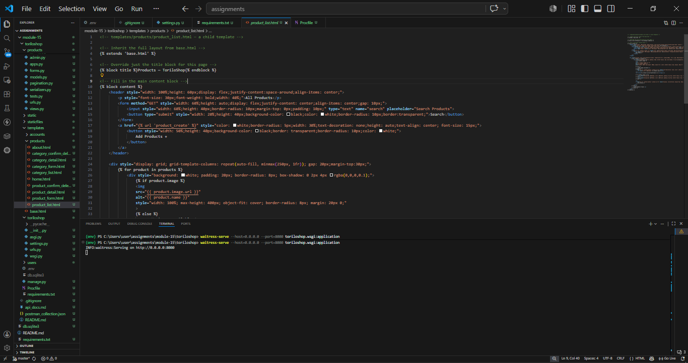
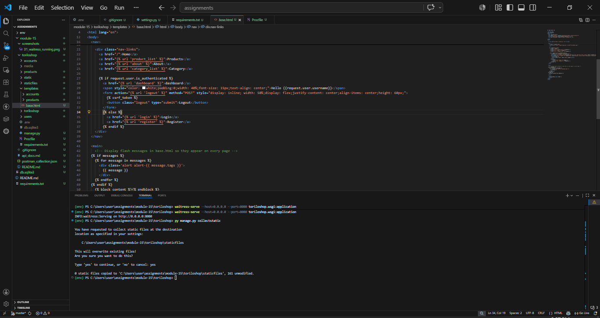
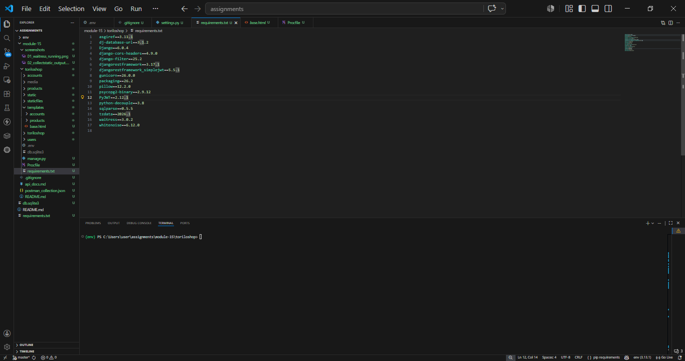
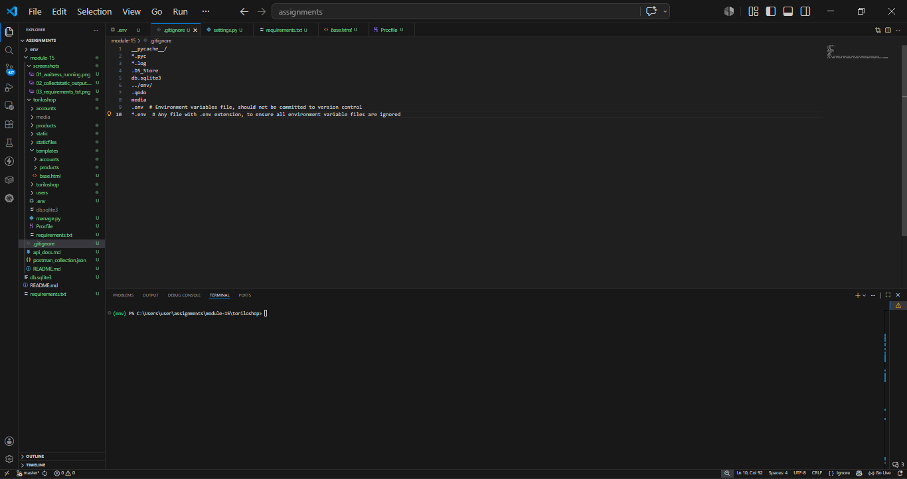

### PROJECT DESCRIPTION 

# TORILOSHOP PRODUCTION-READY VERSION
This repository contains the production-ready version of **toriloshop**. The project has been refactored and optimized to transition from a local development environment to a secure, high-performance production hosting infrastructure. 

Key architectural modifications include:
*   **Decoupling Secrets:** Separated application code from environment-specific variables.
*   **Dynamic Database Routing:** Switched from a hardcoded database path to an environment-driven connection string.
*   **Static Asset Management:** Implemented an enterprise-grade compilation strategy to compress and cache frontend files natively.
*   **Production WSGI Containers:** Replaced the insecure Django development server with enterprise-grade web server gateways.

##  Features Implemented

*   ** Secure Configuration Layer (`python-decouple`):** Sensitive assets such as `SECRET_KEY`, `DEBUG` switches, and host routing parameters are pulled from a secure `.env` runtime context file.
*   ** Unified Database Interface (`dj-database-url`):** Configured a dynamic abstraction layer that automatically drops back to localized SQLite engines during active development workflows, while binding to fully scalable PostgreSQL engines in cloud environments.
*   ** Production Static File Architecture (`whitenoise`):** Integrated static asset optimization pipelines directly into the Django request/response middleware loop, delivering auto-compressed and cached static assets without separate CDN configurations.
*   ** Cross-Platform WSGI Implementation:** 
    *   **Gunicorn:** Integrated as the primary execution runtime engine inside Unix-based cloud deployment servers via a localized `Procfile`.
    *   **Waitress:** Integrated to serve as a high-efficiency multi-threaded execution server to test deployment status locally within Windows development environments.

---
        
## SETUP INSTRUCTIONS
### 1. Clone the Repository
Clone the application repository to your local directory and navigate into the project root folder:
```bash
git clone <your-repository-url>
cd toriloshop
```
    MOVING IN DIRECTORIES: 
        a. cd into the assignments folder
        b. cd into the module-15 folder
2. CREATE A VIRTUAL ENVRONMENT: py -m venv env would create a virtual env 
3. ACTIVATE THE VIRTUAL ENVIRONMENT: env\Scripts\Activate would activate the virtual env
4. INSTALL DEPENDENCIES: py -m pip install -r requirements.txt
5. CREATE A .env FILE: create a .env file in the root directory and add the following environment variables:
    SECRET_KEY=your_secret_key
    DEBUG=True
    ALLOWED_HOSTS=127.0.0.1,localhost
    DATABASE_URL=sqlite:///db.sqlite3
6. CREATE A .gitignore FILE: create a .gitignore file in the root directory and add the following lines to ignore the .env file and the db.sqlite3 file:
    .env
    db.sqlite3
7. Build and syncronize the app state :
      a. waitress-serve --port=8000 toriloshop.wsgi:application - this would start the development server on port 8000
      then visit localhost:8000 in your browser to see the application running
8. MAKE MIGRATIONS AND MIGRATE: py manage.py makemigrations then py manage.py migrate
9. CREATE SUPERUSER : py manage.py createsuperuser 


# SCREEN SHOTS 
1. waitress running 
2. collectstatic output 
3. requirements.txt file 
4. .gitignore file 
